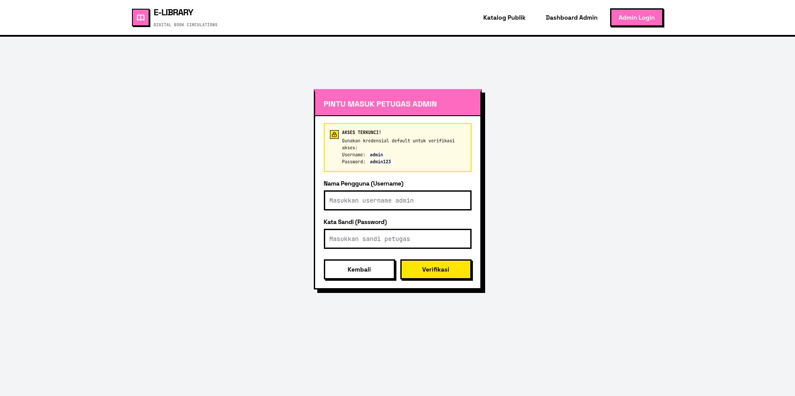
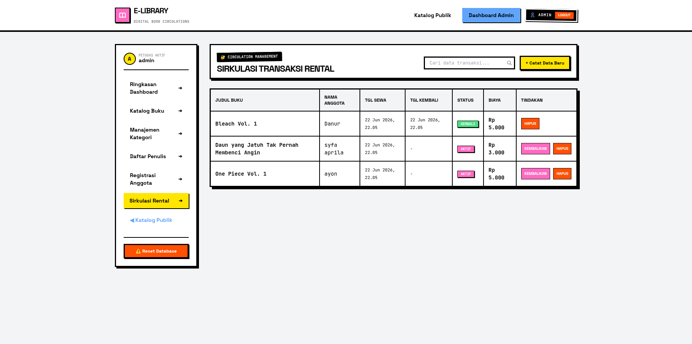
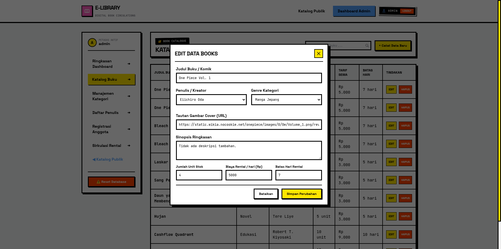
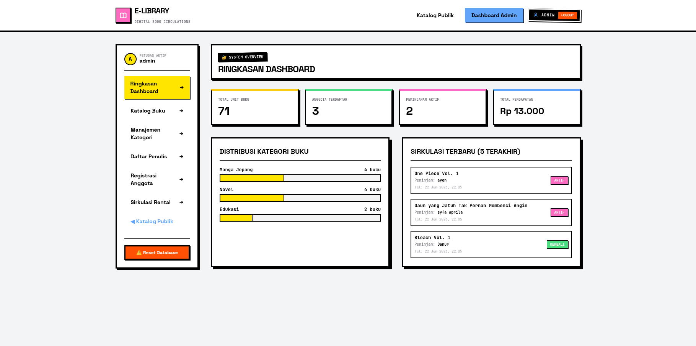
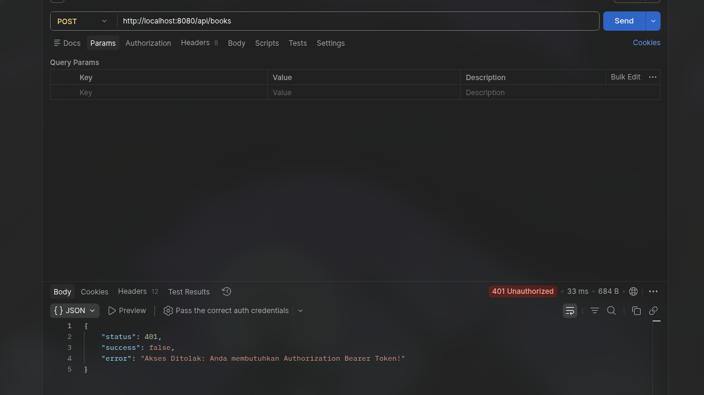

# E-Library Management System
*Proyek Akhir UAS Pemrograman Web 2 — Universitas Pelita Bangsa*

Selamat datang di repositori **E-Library**, sebuah sistem informasi manajemen rental buku & komik digital yang dibangun dengan pendekatan *Decoupled Architecture*. Sistem ini memisahkan antara Backend API (CI4) dan Frontend SPA (VueJS 3) untuk performa yang lebih optimal dan *scalability* yang lebih baik.

---

## Fitur Utama
Sistem ini dilengkapi dengan fungsionalitas manajemen data yang komprehensif:

* **Autentikasi Admin:** Keamanan terjamin dengan *Bearer Token* dan *Middleware Filter* untuk setiap endpoint sensitif.
* **Dashboard Statistikal:** Visualisasi data *real-time* mengenai buku, anggota, dan performa peminjaman.
* **Manajemen Master Data:** CRUD lengkap untuk Buku, Penulis, Kategori, dan Anggota.
* **Sistem Peminjaman (Loans):** Pelacakan status peminjaman (Active/Returned/Overdue) dengan kalkulasi biaya otomatis.
* **Neo-Brutalist UI:** Desain antarmuka modern, tajam, dan responsif menggunakan TailwindCSS.

---

## 🛠️ Tech Stack
| Komponen | Teknologi |
| :--- | :--- |
| **Backend** | PHP 8.x, CodeIgniter 4 (RESTful API) |
| **Frontend** | VueJS 3 (SPA), Vue Router, Axios |
| **Styling** | TailwindCSS (Utility-first) |
| **Database** | MySQL / MariaDB |
| **Tools** | Postman (Testing), Git (Version Control) |

---

## Tampilan Antarmuka
*(Tempatkan screenshot aplikasi lo di sini untuk memberikan gambaran visual kepada user/penguji)*

| Halaman Login |
| :---: |
| 

| Dashboard Admin |
| :---: |
| 

| Modals Tambah/Edit | 
| :---: |
| 

| Tabel Data Responsif |
| :---: |
| 

---

## Arsitektur Database
Sistem ini menggunakan relasi database yang terstruktur untuk menjamin integritas data:
* `users`: Pengelolaan akun admin.
* `books` & `authors`: Relasi *one-to-many* atau *many-to-many*.
* `loans`: Penghubung utama antara `members` dan `books`.

> **[LAMPIRKAN SCREENSHOT DATABASE PHPMyAdmin DI SINI]**

---

## Testing API (Postman)
Berikut adalah bukti autentikasi keamanan API (Error 401 Unauthorized):

> **
**

---

## Cara Menjalankan Proyek
1.  **Clone repositori:** `git clone https://github.com/username/UAS_Web2_NIM_Nama.git`
2.  **Setup Backend:**
    * Import file `.sql` ke MySQL.
    * Konfigurasi `.env` di folder `backend-api/`.
    * Jalankan `php spark serve`.
3.  **Setup Frontend:**
    * Masuk ke folder `frontend-spa/`.
    * Buka `index.html` via Live Server atau hosting lokal.
4.  **Akses:** Buka `http://localhost:8080` (sesuaikan).

---

## Demo & Presentasi
### Live Testing

  

---
* **Video Demonstrasi:** https://youtu.be/BdqJtT2t4JM?si=56-za11JAPAl0gJh
---
*Dibuat oleh: **DANUR WENDA PRASETIYO** | Universitas Pelita Bangsa*
